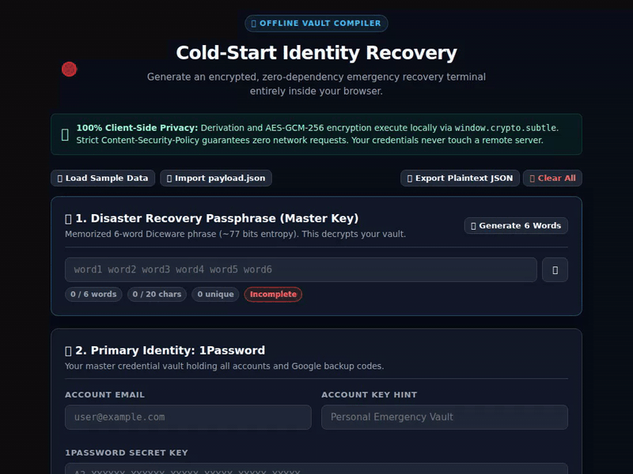

# Cold-Start Identity Recovery Protocol

[](https://github.com/janhrabcak/identity-recovery/actions/workflows/ci.yml)
[](https://github.com/janhrabcak/identity-recovery/actions/workflows/staleness-check.yml)


-blueviolet?style=flat-square)


Stateless, zero-hardware emergency credential recovery protocol designed to restore primary identity and root-of-trust access from an untrusted terminal or newly procured device anywhere in the world.

<p align="center">
  
</p>

### 🛡️ Repository Health & Cryptographic Posture

| Dimension | Indicator | Operational Guarantee |
|---|---|---|
| **Cryptographic Parity** | `🟢 19/19 Passed` | Node.js WebCrypto $\leftrightarrow$ Browser WebCrypto end-to-end verified |
| **Supply Chain Risk** | `🟢 0 Dependencies` | Pure Node.js standard libraries & browser-native APIs (zero npm attack surface) |
| **Edge Header Security** | `🟢 Hardened` | Strict CSP (`default-src 'none'`), `no-store` cache control, anti-clickjacking (`DENY`) |
| **Vault Freshness** | `🟢 Automated` | Bi-monthly GitHub Actions audit + multi-channel push alerts (ntfy/Discord/Slack) |
| **Disaster Fallback** | `🟢 Redundant` | Secondary RFC 1035 DNS TXT dead-drop via Anycast DoH (Cloudflare + Google failover) |
| **Memory Sanitation** | `🟢 Active Purge` | Ephemeral DOM lifecycle, "Lock & Purge", panic keybind (`Esc` $\times 3$), auto-scrubbing |

---

## 🎯 Protocol Overview

- **Disaster Scenario:** Total physical hardware loss (lost phone, lost YubiKey, lost wallet, no trusted devices).
- **Modular Credential Cards:** Flexible, composable secret blocks for:
  - 🔑 **Password Managers:** 1Password, Bitwarden, KeePassXC, Dashlane, Proton Pass, or custom vaults.
  - 🛡️ **2SV Backup Codes:** Google, GitHub, Apple Recovery Keys, Microsoft, AWS, or any service (with per-card interactive burned code tracking).
  - 🌱 **Seed Phrases:** BIP-39 12/18/24-word recovery phrases for Ledger, Trezor, MetaMask, Phantom, etc., with click-to-reveal word chips.
  - ⏱️ **Live In-Browser TOTP:** Real-time 30-second rotating two-factor codes for unlimited services.
  - 🔐 **Custom Secrets & Keys:** Arbitrary key-value fields for SSH keys, LUKS disk passphrases, PGP fingerprints, and PINs.
  - 📝 **Emergency Instructions:** Rich text emergency contacts, trusted numbers, and protocol guidelines.
- **Key Material:** Memorized 6-word Diceware passphrase (~77 bits entropy).
- **Cryptography:** AES-GCM-256 with PBKDF2-SHA-256 (600,000 iterations, 16-byte random salt, 12-byte random IV).
- **Runtime:** Single-file zero-dependency `public/index.html` executing native WebCrypto (`window.crypto.subtle`).
- **Primary Dead-Drop:** Edge Anycast CDN (`https://sos.<yourdomain>.com` on Cloudflare Pages, Netlify, or Vercel).
- **Secondary Dead-Drop:** RFC 1035 DNS TXT record (`recovery.<yourdomain>.com`) queryable via DNS-over-HTTPS (DoH).

---

## 🏗️ Architecture Flow

```text
[Trusted Local Machine]
   Credentials + 6-word Passphrase
         |
         +---> Option A: tools/builder.html (Offline WebCrypto GUI)
         |        |
         |        +---> Generates & downloads hardened index.html
         |        +---> Deploys to Cloudflare Pages (Direct Upload or Git)
         |        +---> Copies Base64 ciphertext for DNS TXT dead-drop
         |
         +---> Option B: ./scripts/deploy.sh (Automated CLI Pipeline)
                  |
                  +---> public/index.html (Pushed to Cloudflare Edge)
                  +---> DNS TXT Dead-Drop (Synced via Cloudflare API)
                  +---> Shreds plaintext payload.json (3 passes + zero-fill)

[Untrusted Kiosk / Disaster Device]
   1. Visit https://sos.<yourdomain>.com (or query DNS TXT)
   2. Enter memorized 6-word passphrase
   3. In-browser WebCrypto decrypts payload client-side
   4. Copy single-use Google backup code or view live TOTP
   5. Sign in to Google -> Access 1Password -> Recover all accounts
   6. Click "Lock & Purge" (or press Escape x3) to wipe all memory
```

---

## ⚡ 5-Minute Quick Start (Deploying Your Vault)

Anyone can clone and deploy their own recovery vault in 5 minutes:

### 1. Clone or Use as Template
Click **Use this template** on GitHub (or clone into a private repository):
```bash
git clone https://github.com/janhrabcak/identity-recovery.git my-vault
cd my-vault
```

### 2. Configure Environment
```bash
cp .env.example .env
# Set your recovery DNS domain (e.g. RECOVERY_DOMAIN=recovery.yourdomain.com)
```

### 3. Prepare Credentials & Deploy

#### Option A: Offline Web Builder (No Node.js/Terminal Needed)
Simply double-click or open `tools/builder.html` in your web browser:
1. Enter your credentials or load from `templates/sample-payload.json`.
2. Generate or enter your 6-word Diceware passphrase.
3. Click **Encrypt & Build Recovery Terminal** and download `index.html`.
4. Follow the on-screen manual instructions to update Cloudflare Pages and your DNS TXT record.

#### Option B: Hardened CLI Pipeline
```bash
# Generate a clean starting schema:
node scripts/encrypt.js --sample fresh
cp templates/sample-payload.json payload.json
# Edit payload.json with your real secrets

# Run the automated deployment pipeline:
./scripts/deploy.sh payload.json
```
The script will prompt for your 6-word passphrase, verify entropy, run 19 automated tests, commit strictly `public/index.html`, push to `main`, and securely shred `payload.json`.

### 4. Connect Cloudflare Pages, Netlify, or Vercel (Free)
- **Cloudflare Pages:** Connect Git or deploy via Wrangler (`./scripts/deploy.sh`).
- **Netlify:** Connect Git (uses `netlify.toml`) or Direct Upload (`./scripts/deploy.sh --provider netlify`).
- **Vercel:** Connect Git (uses `vercel.json`) or Direct Upload (`./scripts/deploy.sh --provider vercel`).

---

## 📚 Detailed Documentation

| Guide | Description |
|---|---|
| [**`docs/DEPLOYMENT.md`**](docs/DEPLOYMENT.md) | Multi-provider deployment (Cloudflare Pages, Netlify, Vercel, Caddy, Nginx) and DNS TXT dead-drop configuration. |
| [**`docs/CLI_REFERENCE.md`**](docs/CLI_REFERENCE.md) | Command-line reference for `deploy.sh`, `encrypt.js`, `check-staleness.js`, and test suites. |
| [**`docs/FEATURES.md`**](docs/FEATURES.md) | In-depth breakdown of live TOTP generation, offline QR codes, panic keybind, clipboard auto-scrubbing, and print sheets. |
| [**`SPEC.md`**](SPEC.md) | Complete cryptographic and architectural specification, schema definitions, and threat model. |

---

## 📁 Project Structure

```text
identity-recovery/
├── public/                       # 🌐 Public edge deployment (Cloudflare Pages / Netlify / Vercel)
│   ├── index.html                # Recovery terminal UI (contains encrypted ciphertext)
│   └── _headers                  # Strict HTTP security headers (CSP, HSTS, no-store)
│
├── tools/                        # 🖥️ Offline client-side browser tools
│   └── builder.html              # Standalone web builder to generate index.html offline
│
├── scripts/                      # 🛠️ Private offline tooling (trusted machine only)
│   ├── build-builder.js          # Generator script to refresh tools/builder.html
│   ├── deploy.sh                 # 7-step rotation, verification, and publish pipeline
│   ├── encrypt.js                # WebCrypto AES-GCM / PBKDF2 offline CLI
│   └── check-staleness.js        # Zero-knowledge staleness evaluator for CI/alerts
│
├── .github/workflows/            # ⏰ CI & scheduled monitoring
│   ├── ci.yml                    # Automated tests across Node 18, 20, 22
│   └── staleness-check.yml       # Bi-monthly automated staleness alert workflow
│
├── docs/                         # 📖 In-depth guides
│   ├── DEPLOYMENT.md             # Cloudflare Pages, Netlify, Vercel, & DNS setup
│   ├── CLI_REFERENCE.md          # Manual CLI flags & offline workflow
│   └── FEATURES.md               # UI features (TOTP, QR, panic keybind)
│
├── templates/                    # 📋 Dummy schemas
│   └── sample-payload.json       # Template schema with TOTP seeds
│
├── tests/                        # 🧪 Verification suite
│   └── test-suite.js             # 19 automated cryptographic & integrity tests
│
├── vercel.json                   # Vercel edge security header configuration
├── netlify.toml                  # Netlify edge security header configuration
├── .env.example                  # Environment template (RECOVERY_DOMAIN)
├── .gitignore                    # Security boundary (blocks unencrypted payload.json)
├── README.md                     # Landing page & quick run guide
└── SPEC.md                       # Full cryptographic specification
```

---

## 🔒 Security Cardinal Rule

> [!CAUTION]
> **Never commit unencrypted credentials (`payload.json`) to Git.**
> The `.gitignore` is strictly configured to bar `payload.json`, `*secret*`, and private environment files. The only file that touches Git is `public/index.html` containing the AES-GCM-256 encrypted ciphertext, which is cryptographically safe for public hosting assuming $\ge 77$ bits entropy.
